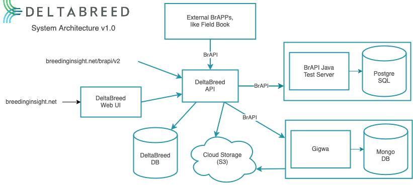

<div align="center">
    
</div>

<h2 align="center">
    This repo contains the docker-compose configurations used to run DeltaBreed.
</h2>

# Table of Contents
<p align="center">
  <a href="#get_started">Getting Started</a> |
  <a href="#architecture">Architecture</a> |
  <a href="#other-envs">Setting Up Other Environments</a>
</p>

# <a id="get_started"></a>Getting Started
## Outline
<ul>
<li>Download prereqs</li>
<li>Set up OAuth with ORCID</li>
<li>Set up environmental variables</li>
<li>Run docker-compose</li>
<li>Get ORCID credentials into database</li>
<li>Access DeltaBreed on web</li>
</ul>

## Download Prereqs
Docker and Docker-compose are both required.

## Set up OAuth with ORCID
Running DeltaBreed requires setting up OAuth with [ORCID](https://info.orcid.org/what-is-orcid/) (Open Researcher and Contributor ID).

<ol>
<li><a href="https://orcid.org/register">Create an ORCID account</a></li>
<li>Sign into ORCID</li>
<li>Go to "Developer Tools"</li>
<li>Agree to Terms of Service and register for ORCID public API credentials</li>
<li>Enter application name and description (no particular requirements)</li>
<li>Enter application URL <code>http://test.localhost:8080</code> (todo check this can work)</li>
<li>Add Redirect URI <code>http://test.localhost:8081/sso/success/orcid</code></li>
<li>Select "Save application" at the bottom of the page</li>
<li>Copy the generated Client ID and Client Secret to add to the .env file (see <a href="env_vars">Set up environmental variables</a>)</li>
</ol>

## <a id="env_vars"></a>Set up environmental variables
To set necessary private environmental variables for DeltaBreed to run, at the root level of the repo locally create a file called `.env`. 
A template exists named `.env.quicktemplate` that has most environmental variables already filled. 
If a user wants to customize services in more depth (not covered in this quick start guide), they can instead base their `.env` off of `.env.template`.

The following is guidance for filling out remaining parts of `.env.quicktemplate`.

(TODO remaining vars)

The containers are not run by the root user but by a new user and group called
'host'.  The user and group ids for host are both set to 1001 by default.  If
you wish to change these to your own user and group ids, add the following
contents to .env:
```
USER_ID=1001
GROUP_ID=1001
```
Change 1001 to your own id values.  You can find at the console your user and group ids using the id command:
for user id
```
id -u
```
and for group id
```
id -g
```

## Run docker-compose
Run the following in the bi-docker-stack repository

```
docker-compose -f docker-compose.yml -f docker-compose-redis.yml -f docker-compose-gigwa.yml -f docker-compose-localstack.yml -f docker-compose-mailhog.yml -f docker-compose-qa.yml up -d --build
```

## Get ORCID credentials into database
For Mac/Linux, run `addUser.sh`

For Windows, run `addUser.ps1`

## Access DeltaBreed on web
DeltaBreed can then be accessed via the url entered for ```WEB_BASE_URL``` in the .env file.

# <a id="architecture"></a> Architecture
The primary components of DeltaBreed are the Web UI (Breeding-Insight/bi-web) and the API (Breeding-Insight/bi-api).
The [BrAPI Java Server](https://github.com/plantbreeding/brapi-Java-TestServer) is used for phenotypic data storage, [Gigwa](https://github.com/SouthGreenPlatform/Gigwa2) is used for genotypic data storage, and interoperability with external applications such as [Field Book](https://github.com/PhenoApps/Field-Book/) is enabled by [BrAPI](https://brapi.org/).
DeltaBreed uses [ORCID](https://orcid.org/) for authentication.



# <a id="other_envs"></a>Setting up Other Environments
## Development Environment

To run a development environment, you will need to initialize the git submodules that exist within this repository:

```
git submodule update --init --recursive
```

Then run:

```
docker-compose -f docker-compose.yml -f docker-compose-redis.yml -f docker-compose-gigwa.yml -f docker-compose-dev.yml up -d
```

## Production Environment

An instance of Redis and Gigwa are expected to be running.  The `.env` file must be updated to reflect where these services live.  To stand up instances of Redis or Gigwa, please refer to their respective docker-compose files (`docker-compose-redis.yml`, `docker-compose-gigwa.yml`)

```
docker-compose up -d
```

## Pre-Production Environment
```
docker-compose -f docker-compose.yml -f docker-compose-redis.yml -f docker-compose-gigwa.yml -f docker-compose-qa.yml -f docker-compose-rc.yml up -d
```

## QA Environment
```
docker-compose -f docker-compose.yml -f docker-compose-redis.yml -f docker-compose-gigwa.yml -f docker-compose-qa.yml up -d
```

## AWS S3 Configuration
If running in production, then you will need to create an AWS IAM role to generate an access key and secret.  You will also need to define a bucket in S3 to hold the data.

If you do not want to use AWS, you can utilize the localstack configuration by including `-f docker-compose-localstack.yml` in your `docker-compose up` command.

Then values for the AWS parameters can be set as follows:

```
AWS_ACCESS_KEY_ID=test
AWS_SECRET_KEY=test
AWS_S3_ENDPOINT=http://localhost:4566
```

## TLS Support
In a deployment environment TLS support can be easily provided by the reverse
proxy container which already has Certbot by LetsEncrypt installed. The
deployment environment should set the value of the environment variable
`REGISTERED_DOMAIN` to the value of the registered domain for deployed instance.  
NOTE* This environment variable should be added to your `.env` file

Bash into the docker container named `biproxy` and call Certbot.

```
docker exec -it biproxy bash
certbot --nginx -d <REGISTERED_DOMAIN>
```

Certbot will ask a series of questions to be answered interactively, then 
automatically install the TLS certs and update the nginx config files.

## Reverse Proxy
The nginx config files and TLS certs are stored on volumes mounted on the host
machine, ensuring that TLS will continue to be used even after restarting the
docker stack after code updates. However, this also means that a volume must be
removed before restarting the stack if there are updates to the configuration of
the reverse proxy.

The Dockerfile for the reverse proxy contains the nginx rules used to direct
traffic to the appropriate upstream server. Any new features added to bi-api
that use an endpoint not in the /v1/ or /sso/ name spaces must have a rule added
to the proxy config in order to send these requests upstream.
